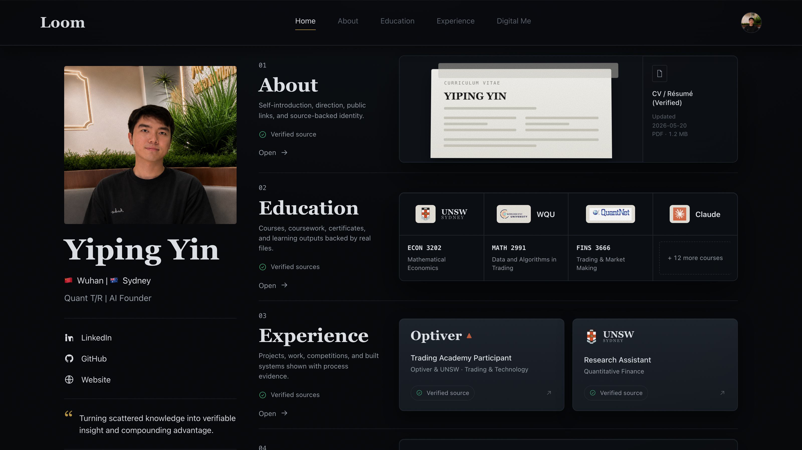
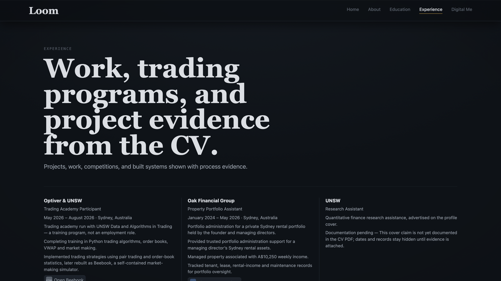
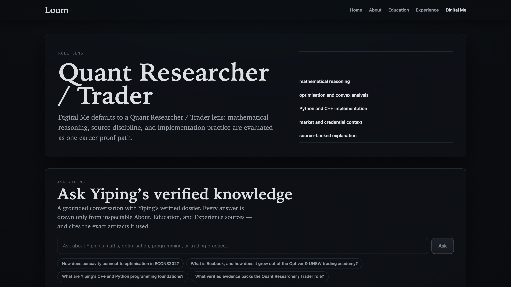

> ⚠️ **已过时（2026-07-10）。** 本 README 是 LOOM 早期"知识系统 / Cursor for thought"框架，已被收敛后的定稿取代。当前定稿（冲突处以这三份为准，本文件仅作历史参考）：[`NORTH_STAR.md`](NORTH_STAR.md)（一页版）· [`docs/LOOM_STATE.md`](docs/LOOM_STATE.md)（总纲）· [`docs/COMMERCIAL_VALIDATION.md`](docs/COMMERCIAL_VALIDATION.md)（证据底稿）。

# Loom

### Let your work unfold from the sources you actually have.

**A local context-to-form workspace for the AI era** — your files, captures, notes, projects,
and AI conversations become source-backed forms, and the strongest forms can represent you.

---

## Why Loom

Today we spend years learning, building projects, shipping portfolios, and talking to AI. But all
of that knowledge fragments across documents, notes, chats, certificates, and platforms. So we keep
losing context about who we are and what we can do — and every interview, collaboration, or
introduction means **reconstructing our story from scratch**.

Loom solves this by giving source material a place to become form. It connects a person's learning
journey, projects, experiences, and AI conversations into a local workspace where sources are
resolved, shaped into Studio documents, and then selectively represented as a living Digital Me.

> In the AI era, your most valuable asset isn't your résumé or portfolio — it's the source-backed
> record of what you have learned, made, tested, and understood. Loom helps that record become
> usable form.

The loop, in three product surfaces:

| Sources | Studio | Digital Me |
|---------|--------|------------|
| Bring in files, captures, notes, and prior work; resolve them into claims, quotes, examples, contradictions, gaps, and questions. | Shape resolved source pieces into block documents, cited answers, process pages, proofs, and artifacts. | Present selected forms and source-backed claims as a living representation that can answer with citations. |

---

## The product

### Sources — context before conclusions

Sources is where real material enters Loom: local files, rich web captures, notes, AI chats,
coursework, certificates, project evidence, and process records. It is not a dumping ground.
Its job is to help the user resolve context into usable pieces: claims, quotes, examples,
contradictions, gaps, and questions.

### Studio — form from evidence

Studio is the workbench where those pieces become something durable: a block document, cited answer,
process page, proof artifact, portfolio explanation, or public writeup. The old `/draft` route and
Draft storage language remain compatibility/implementation details; the user-facing product surface
is Studio.

### Digital Me — representation, not the starting point

Every claim resolves to a real file or Studio form. About · Education · Experience · Digital Me form
one coherent, inspectable identity; visitors open the source behind any statement instead of taking
it on trust.

Digital Me turns the dossier into a conversational interface. **Ask Yiping** anything; answers are
drawn only from verified evidence, with citations back to the underlying sources. A Role OS maps
each claim to how strongly its sources back it, and a working market-making replica is embedded as
runnable proof.

### Proof you can run — not a screenshot

Capability is shown, not asserted: *QBook* — a fully self-contained trading terminal inspired by
the Optiver × UNSW trading academy — order book, leaderboard, trade ticker, and market-making
practice — that keeps running **offline, after the source site retires.**

---

## Where it stands

- **Live reference instance** — Yiping's Loom is a full working dossier, public on the web. The
  real shelves (UNSW · QuantNet · WorldQuant · Claude · Optiver) prove the product model; they are
  not the product boundary.
- **Built test-first** — every surface is pinned by a contract test.
- **Two runtimes, one core** — a native macOS app and a deployable web app.

A roadshow pitch deck lives at [`docs/deck/loom.pptx`](docs/deck/loom.pptx).

---

## Install

- **macOS 14 Sonoma or later**, Apple Silicon.
- **Mac App Store** — coming soon. In the meantime, grab the signed + notarized Developer-ID build from the [Releases](https://github.com/Yiping-Yin/loom/releases) page: download the `.dmg`, drag *Loom.app* into *Applications*, open it, and press **⌘K** to open the command menu.
- **From source** — see the **Dev Flow** section below.

Your files stay on your Mac. Bring your own API key for Anthropic or OpenAI, or point Loom at a local Ollama. Keys live in the macOS Keychain. On the web, set `ANTHROPIC_API_KEY` to enable live *Ask Yiping* answers; without it the dossier degrades gracefully to showing the sources an answer would draw from.

---

## What this is

Loom is a thinking tool. Not a note app, not a chat app, not a generic AI assistant floating outside your sources — a source-backed workspace for turning scattered material into inspectable form.

Its core jobs are to:

- resolve source material before asking AI to write from it;
- shape resolved context into Studio forms with explicit provenance;
- show finished work as portfolio with proof;
- let a grounded personal AI answer from selected forms and sources instead of from a generic prompt;
- keep files, notes, references, forms, and decisions owned by the user.

In the AI era, two things matter that no chat tool gives you at the same time: **speed** (your brain never stops, ideas leap, you talk to AI continuously) and **permanence** (the trail of that thinking doesn't disappear when you close the tab). Loom gives you both.

---

## What this is not

- **Not a note app.** Notes are dead text. Source-bound notes are living structures linked to sources.
- **Not a chat app.** Chats are linear and disposable. Loom anchors understanding to source.
- **Not a wiki.** Your archive is built from your sources, notes, and draft decisions.
- **Not a generic AI assistant.** AI is grounded in the user's sources and archive; it supports source-backed work instead of inventing the record.
- **Not a productivity tool.** Loom doesn't help you do more. It helps you understand more.

---

<strong>Why it's called Loom</strong> — the kesi origin (historical framing)

 

This origin story explains the name and early design language. It is not the current product navigation model; current visible product language is Sources, Studio, and Digital Me.

Not because the interface draws warp and weft. Because the product **does what a loom does**.

A kesi weaver sits before a loom. The loom holds the tension, aligns the threads, structures the fabric. The weaver's job is to choose where to place color and when to break the weft. The loom absorbs the organizational burden; the weaver focuses on intent.

A Loom user sits before a document. The AI organizes the answer, anchors it to the right passage, connects it to prior thoughts. The user's job is to choose what to ask and when to commit. Loom absorbs the organizational burden; the thinker focuses on intent.

The defining kesi technique is **continuous warp, broken weft** (通经断纬): the warp runs through the whole fabric unbroken — your sustained library of sources — while the weft moves only within one color block, so each thought keeps a clean boundary. ChatGPT is continuous warp *and* weft: everything blurs into one infinite scroll. Loom is continuous warp, broken weft — each thought has its own panel, and the picture emerges only as panels join. It is the discreteness that lets the picture be seen.

---

## Dev Flow

- `npm install` then `npm run verify` runs typecheck, production build, and smoke checks in the correct order.
- `npm run dev` starts the Next.js surface at `http://127.0.0.1:3000`.
- `npm run test:contracts` runs the contract suite that pins every surface.
- `npm run knowledge:refresh` rebuilds the local knowledge caches under `knowledge/.cache/` and prunes old generated files from `public/`.
- `npm run app`, `npm run app:user`, and `npm run app:system` build and install the macOS shell.
- `npm run app:where` prints the currently installed *Loom.app* location.
- [docs/README.md](docs/README.md) indexes current design and process docs.
- [docs/REPO_STRUCTURE.md](docs/REPO_STRUCTURE.md) defines where code, specs, archives, captures, and generated files belong.
- [docs/projects/active/README.md](docs/projects/active/README.md) is the entry point for current Loom product work.

---

## Contributing

Pull requests are welcome. See [CONTRIBUTING.md](CONTRIBUTING.md) for the
shape of the project and the PR checklist. For security issues, see
[SECURITY.md](SECURITY.md) — please don't file those as public issues.

Loom is built with substantial help from OpenAI Codex and Claude. See
[AUTHORS.md](AUTHORS.md) for how AI-assisted commits are tagged in
the history.

## License

Loom is released under the **[Apache License, Version 2.0](LICENSE)**.
See the [NOTICE](NOTICE) file for attribution and trademark terms.

"Loom," the Loom word-mark, and the Loom kesi-weave icon are trademarks
of Yiping Yin. The Apache 2.0 grant covers the software source code
only; it does not grant a license to use these marks in a derivative
product that identifies itself primarily as "Loom." Fork freely;
rename the fork.

---

*Resolve in Sources. Shape in Studio. Represent through Digital Me.*

