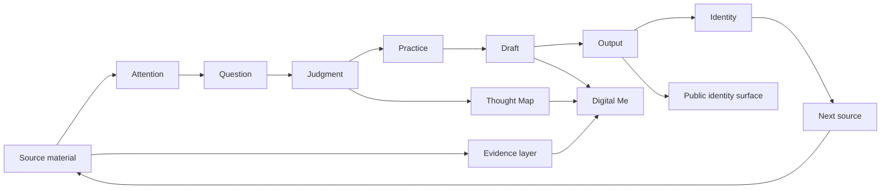

# Loom Product System Architecture

Status: active product architecture
Date: 2026-06-04
Scope: product depth, IA, data model direction, Digital Me, future design work

Loom must not be reduced to a simple personal showcase. A showcase displays a
finished identity. Loom should show the system that forms identity over time.

The current product should be understood as five connected layers.

## Layer 1. Public Identity Surface

This is what a visitor sees first.

Routes:

- About
- Education
- Experience
- Digital Me

Purpose:

- introduce Yiping
- show current direction
- make learning and work inspectable
- demonstrate Digital Me

Risk:

- becoming a static profile website
- becoming a card grid of assets
- over-explaining Loom instead of showing proof

Rule:

The public surface can be simple, but it must point into deeper evidence and
growth structure.

## Layer 2. Evidence And Source Layer

This is the trust foundation.

Objects:

- source file
- institution mark
- certificate
- course folder
- document preview
- source path
- date, file kind, page count, file size
- citation

Purpose:

- make claims inspectable
- prevent profile copy from becoming unsupported self-description
- keep source authority ahead of AI output

Current reusable code:

- `VERIFIED_DOSSIER_ARTIFACTS`
- `VERIFIED_DOSSIER_ASSET_MANIFEST`
- `UNSW_SHELF_*`
- `DocumentPreviewCard`
- `FileBadge`
- `InstitutionMark`

Rule:

Every important public claim should be capable of pointing to evidence, even if
the first viewport does not show all evidence at once.

## Layer 3. Growth And Capability Layer

This is the depth layer.

Objects:

- growth thread
- learning path
- project path
- practice artifact
- judgment change
- capability proof
- next direction

Purpose:

- show how the person changes over time
- connect education to experience
- make capability more than a label
- let Digital Me explain development, not only facts

Core loop:

Source -> Attention -> Question -> Judgment -> Practice -> Draft -> Output ->
Identity -> Next source

Rule:

If a section only says what exists, it is shallow. A mature section shows what
changed, what caused the change, and what evidence proves it.

## Layer 4. Cognitive Structuring Layer

This is the product ontology inherited from earlier Loom concept work.

Internal concepts:

- Library / Eyes / Memory
- source
- anchor
- question
- judgment unit
- relation
- panel
- weave
- pattern
- thought map

Purpose:

- describe how understanding forms
- prevent the app from becoming linear chat
- prevent the app from becoming manual note management
- organize nonlinear thinking into durable structure

Rule:

These concepts should shape models and interactions. They should not all appear
as public labels.

## Layer 5. AI And Production Layer

This is where source-backed material becomes answers, drafts, canvases, and
replayable process.

Capabilities:

- grounded answer
- source retrieval
- citation strip
- draft generation
- answer preview
- process replay
- capability canvas
- cross-shelf reasoning

Current reusable code:

- `buildDraftUrlFromArtifacts`
- `draft-storage`
- `draft-records`
- `draft-answer-preview`
- `EvidenceWorkbench`
- `SourceGraph`
- `ProvenanceChain`
- Digital Me canvas data in `VERIFIED_DOSSIER_DIGITAL_ME_CANVASES`

Rule:

AI is not the product protagonist. AI is a role-based accelerator for source
understanding, draft production, and growth explanation.

## System View

## What This Means For Current Pages

### Home

Home should not explain every layer. It should show the reference instance and
give clear paths into evidence, growth, and Digital Me.

### About

About should show current identity and direction, then point to evidence and
growth threads.

### Education

Education should show learning as growth: institution -> course -> source ->
practice -> output -> capability.

### Experience

Experience should show applied growth: project or work -> source/practice ->
artifact -> outcome -> next direction.

### Digital Me

Digital Me should be the active interface over all layers. It should answer from
sources, explain growth, cite evidence, generate drafts, and replay process.

### Loom History

Loom history should show the product's own growth thread: concept, visual
research, functional prototypes, evidence workbench, personal IA, asset-led
upgrade, growth model, and system architecture.

## Product Maturity Tests

Before accepting a major Loom change, ask:

1. Does it deepen the growth system, or only improve display?
2. Does it preserve source authority?
3. Does it help form or inspect judgment?
4. Does it reduce organization burden while keeping human judgment central?
5. Does it reuse existing source, draft, and asset primitives?
6. Does Digital Me gain a real capability, not just a new prompt surface?
7. Does the page show evidence, process, and direction instead of only status?

If the answer is mostly no, the change is presentation polish, not product
progress.
